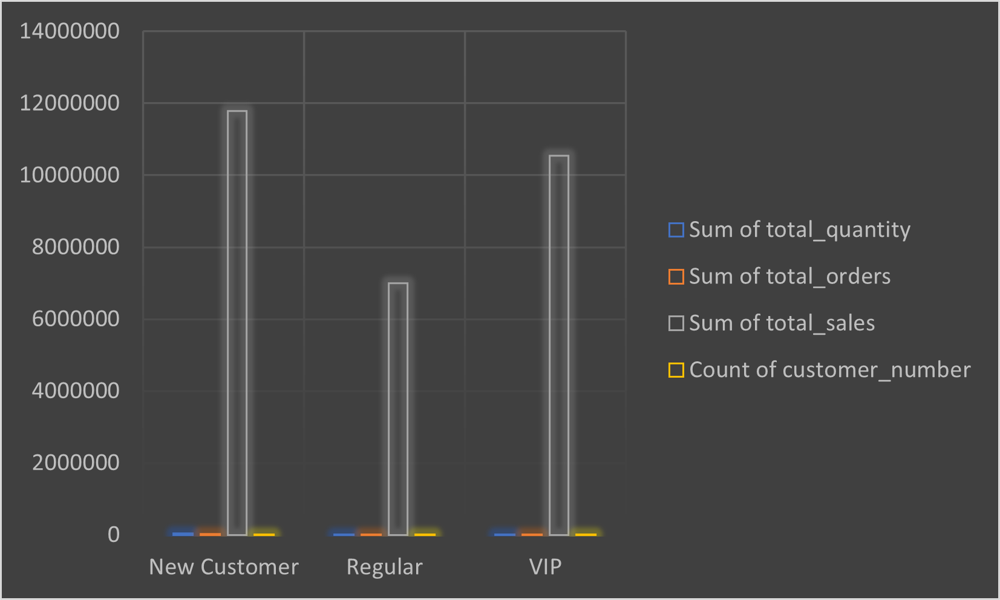
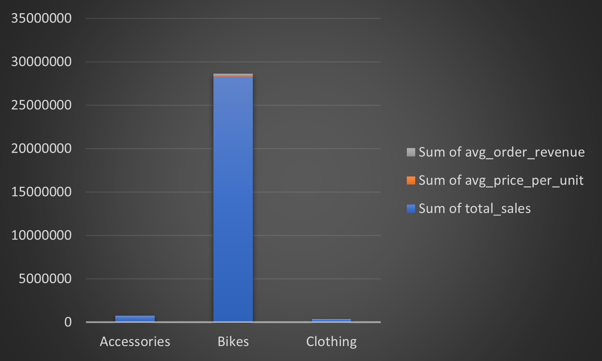
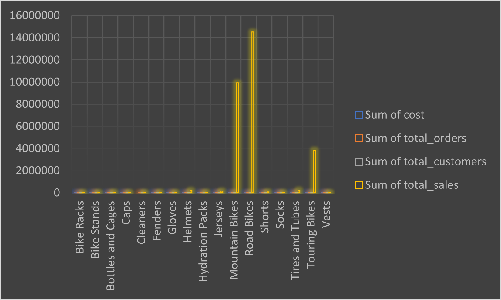
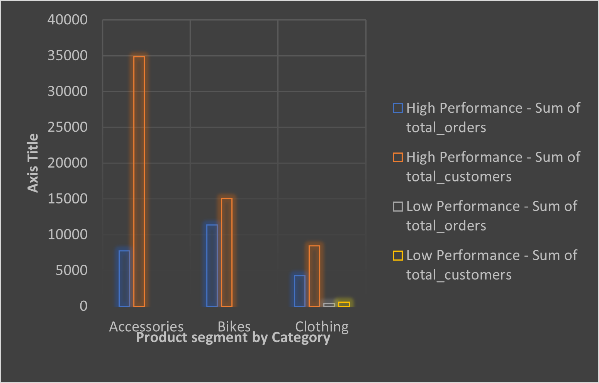

# 🚴‍♂️ Bike Sales Analysis

### 📊 A Data-Driven Exploration of Customer Purchase Behavior  
Uncovering insights, trends, and patterns that influence bike buying decisions through structured analysis and visualization.

---

## Table of Contents

🚀 [Introduction & Project Overview](#🚀-introduction--project-overview)  
📚 [Background](#🌐-project-background)  
🛠️ [Tools & Technologies](#🧰-tools--technologies)  
📊 [Data Analysis & Insights](#📊-data-analysis--insights)  
📈 [Cumulative Analysis](#📈-2-cumulative-analysis)  
🎯 [Performance Analysis](#📊-performance-analysis)  
🍰 [Part-to-Whole Analysis](#🔢-part-to-whole-analysis)  
🧩 [Data Segmentation](#🧩-data-segmentation)  
🔍 [Key Findings](#🔍-key-findings)  
👥 [Customer Insights](#📊-key-findings---customer-insights)  
🛒 [Product Insights](#📊-key-findings---product-insights)  
💡 [Things I Learned](#💡-things-i-learned)  
📝 [Conclusion](#📝-conclusion)  
🙏 [Thank You](#🙏-thank-you)

## 🚀 Introduction & Project Overview

Welcome to the **Bike Sales Analysis** project!  

This project is an **Exploratory Data Analysis (EDA)** of a bike sales dataset. The goal is to uncover insights, understand trends, and answer key business questions using **SQL**. Through this project, you will learn how to ask the right questions and find meaningful answers using both **basic** and **advanced SQL techniques**.  

---

### 🛠️ Phase 1: Exploratory Data Analysis (EDA)

In this phase, we focus on understanding the dataset and extracting insights using **basic SQL skills**.  

**Skills we will be exploring:**  
- ✅ Basic queries  
- ✅ Data profiling  
- ✅ Simple aggregations (SUM, AVG, COUNT)  
- ✅ Subqueries  

**What we’ll do:**  
- Profile the dataset to understand all its aspects  
- Perform aggregations to summarize data  
- Use subqueries to answer specific questions  

> The goal is to develop a strong foundation in **SQL for data analysis** and gain confidence in exploring datasets.  

---

### 🛠️ Phase 2: Advanced Analytics

In this phase, we tackle **real business questions** using **advanced SQL techniques**.  

**Skills we will be exploring:**  
- ✅ Complex queries  
- ✅ Window functions  
- ✅ Common Table Expressions (CTEs)  
- ✅ Subqueries  
- ✅ Generating reports for stakeholders  

**What we’ll do:**  
- Identify trends over time 📈  
- Compare performance across different categories  
- Segment data for deeper insights  
- Generate meaningful reports for decision-makers  

> This phase simulates real-world analytics scenarios, helping you bridge the gap between **basic SQL knowledge** and **business-driven data analysis**.

## 💡 A Little Trick Before We Start

I want to share a little trick I learned from **Baraa** that I use when analyzing any dataset.  

When I look at a dataset, I always divide the data into **two parts**: **Dimensions** and **Measures**.  

> If you see your data as **Dimensions** and **Measures**, you can generate an endless number of insights from any project. In this project, I will always refer to columns as either **Dimensions** or **Measures**.  

---

### 📌 How to Categorize Your Columns

1. **Look at your dataset**: You usually have multiple columns and rows.  
2. **Ask yourself the first question:** Is this column **numeric**?  
   - **No** → It’s a **Dimension**  
   - **Yes** → Go to the next question  
3. **Ask the second question:** Does it make sense to **aggregate** this column?  
   - **Yes** → It’s a **Measure**  
   - **No** → It’s a **Dimension**  

---

### 🗂️ Example

| Column Name        | Numeric? | Can Aggregate? | Category  |
|-------------------|----------|----------------|-----------|
| Sales Amount       | Yes      | Yes            | Measure   |
| Quantity           | Yes      | Yes            | Measure   |
| Product            | No       | No             | Dimension |
| Birthday           | No       | No             | Dimension |
| Age of Customer    | No       | Yes            | Measure   |
| Customer ID        | Yes      | No             | Dimension |

---

### 🔑 Why This Matters

- **Dimensions** are used to **group your data** (e.g., by Product, Customer, Region).  
- **Measures** are used to **aggregate or calculate** values (e.g., total sales, average quantity).  

> Measures answer questions like: *How many? How much?*  
> Dimensions answer questions like: *Group by what? Compare by what?*  

Seeing your data this way is the **foundation of any data analyst’s workflow**. Once you master this, you can generate powerful insights and use cases from any dataset.  

## 🌐 Project Background

The bike sales industry is growing rapidly, and businesses need to understand their sales data to make better decisions.  

This project focuses on analyzing a **bike sales dataset** to uncover trends, identify top-selling products, and understand customer behavior. By exploring the data using **SQL**, we can answer important business questions such as:  
- Which products sell the most? 🚴‍♂️  
- How do sales change over time? 📈  
- What patterns exist in customer purchases? 🛍️  

The insights from this analysis can help businesses **increase revenue, improve inventory management, and make data-driven decisions**.  

> In short, this project shows how we can turn raw sales data into **actionable insights** using both **basic and advanced SQL techniques**.

## ❓ Key Questions Explored with SQL

This project explores the bike sales dataset using both **basic** and **advanced SQL techniques** to answer important business questions.  

---

### 🛠️ Basic SQL Analysis

We start by exploring the dataset with basic SQL techniques:  
1. 🗄️ **Database Exploration** – Understanding the dataset and its structure  
2. 📊 **Dimensions Exploration** – Identifying key categorical columns  
3. 🔍 **Data Exploration** – Checking for missing values, data types, and distribution  
4. 📏 **Measure Exploration** – Analyzing numeric columns for insights  
5. 📈 **Magnitude Analysis** – Summarizing sales, quantity, and other numeric values  
6. 🏆 **Ranking Analysis** – Finding top-performing products, customers, or categories  

---

### 📊 Advanced SQL Analysis

Once we master basic SQL, we tackle **advanced analytics** to answer complex business questions:  
1. ⏳ **Change Over Time** – Tracking trends and patterns across periods  
2. 🔄 **Cumulative Analysis** – Calculating running totals and growth metrics  
3. 🏅 **Performance Analysis** – Comparing sales or performance across categories  
4. 📊 **Part-to-Whole Analysis** – Understanding contribution of each segment to total  
5. 🧩 **Data Segmentation** – Splitting data into meaningful groups for deeper insights  

---

### 📄 Reporting

Finally, we generate **reports** for key stakeholders:  
1. 👥 **Customer Reports** – Insights into customer behavior and purchases  
2. 🚴 **Product Reports** – Insights into top-selling products and inventory trends  

## 🧰 Tools & Technologies

To dive deeply into the bike sales dataset, I leveraged a combination of powerful tools that helped me **extract, analyze, and visualize meaningful insights**:

- 🧮 **SQL** – The backbone of my analysis, enabling me to query the database efficiently and uncover critical insights.  
- 🐘 **PostgreSQL** – The chosen database management system, ideal for handling large volumes of data with reliability and speed.  
- 💻 **Visual Studio Code** – My go-to environment for managing databases, writing, and executing SQL queries seamlessly.  
- 🌐 **Git & GitHub** – Essential for version control, collaboration, and sharing SQL scripts and analysis, ensuring smooth project tracking and transparency.  
- 📊 **Excel Dashboard** – Used for creating clear and engaging visualizations that summarize key insights from the analysis.  

> These tools allowed me to move from raw data to **actionable insights** in a structured, reproducible, and professional way.
---

# 📊 Data Analysis & Insights
## 🗄️ 1. Database Exploration

Let's say hello to the database! In this step, we explore the **structure of our database** to understand tables, views, and columns. This helps us get a foundation for further analysis.  

**Key steps:**  
- Explore all tables in the database  
- Check the columns inside specific tables  
- Get an overview of the database structure  

### 🧾 DATABASE EXPLORATION SQL SOURCE CODE

Here is the source code for the database Exploration . Click below to view the full queries:

[01 CLICK >>>>>DATA EXPLORATION SOURCE CODE SQL](bike_sales_project/1_database_exploration.sql)

## 📊 2. Dimensions Exploration

In this step, we explore the **dimensions** in our dataset — the categorical data that helps us **group, segment, and analyze** sales trends.  

**Why it matters:**  
- Identify unique categories, such as countries or product types  
- Understand how data can be grouped or segmented for later analysis  
- Get a clear overview of the structure and spread of the business  
### 🧾 DIMENSION EXPLORATION SQL SOURCE CODE

Here is the source code for the dimension Exploration . Click below to view the full queries:

[02 CLICK >>>>> DIMENSION EXPLORATION SOURCE CODE SQL](bike_sales_project/2_Dimensions_exploration.sql)

## 📅 3. Date Exploration

In this step, we explore the **time-related aspects** of our dataset to understand the boundaries and span of our business.  

**Objectives:**  
- Identify the **earliest and latest order dates**  
- Understand the **time span** of the business  
- Calculate **years and months of sales data**  
- Explore **customer age ranges**  

### 🧾 DATE EXPLORATION SQL SOURCE CODE

Here is the source code for the date Exploration . Click below to view the full queries:

[03 CLICK >>>>> DATE EXPLORATION SOURCE CODE SQL](bike_sales_project/3_date_exploration.sql)

## 📏 4. Measures Exploration: Big Numbers

In this step, we calculate the **key metrics of the business** — the highest-level aggregations that give us a snapshot of overall performance.  

**Objectives:**  
- Identify total sales, quantity sold, average selling price  
- Count total orders, products, customers, and ordered customers  
- Use aggregate functions (`SUM`, `AVG`, `COUNT`) to summarize numeric data.

### 🧾 MEASURE EXPLORATION SQL SOURCE CODE

Here is the source code for the measure Exploration . Click below to view the full queries:

[04 CLICK >>>>> MEASURE EXPLORATOIN SOURCE CODE SQL](bike_sales_project/4_measures_exploration.sql)

## 📈 5. Magnitude Analysis

Magnitude Analysis compares **measure values across different dimensions and categories**. It helps us understand the **importance and performance of different segments** in the business.  

In this step, we calculate measures **grouped by dimensions** to see which categories, customers, or regions contribute the most to our business.  

**Key analyses performed:**  
1. Total customers by country  
2. Total customers by gender  
3. Total products by category  
4. Average product costs by category  
5. Total revenue generated per category  
6. Total revenue generated by top customers  
7. Distribution of sold items across countries  

### 🧾 MAGINITUDE ANALYSIS  SQL SOURCE CODE

Here is the source code for the maginitude analysis. Click below to view the full queries:

[05 CLICK >>>>> MAGINITUDE ANALYSIS SOURCE CODE SQL](bike_sales_project/5_maginitude_Analysis.sql)

## 🏆 6. Ranking Analysis

Ranking allows us to **order dimension values by measures** to identify top and low performers. This helps highlight **best-selling products, top categories, and underperforming segments**.  

**Key questions explored:**  
- Which 5 products generate the **highest revenue**?  
- Which 5 products generate the **lowest revenue**?  

### 🧾 RANKING ANALYSIS SQL SOURCE CODE

Here is the source code for the ranking analysis . Click below to view the full queries:

[06 CLICK >>>>> RANKING ANALYSIS SOURCE CODE SQL](bike_sales_project/6_Ranking_analysis.sql)

## 🚀 Advanced Analysis

In this phase, we use **advanced SQL techniques** to uncover deeper business insights, including **trends over time, cumulative performance, part-to-whole contributions, and data segmentation**, enabling more strategic decision-making.

## ⏳ 1. Change Over Time

**What is Change Over Time?**  
Change Over Time analyzes **how a measure evolves over a period**, helping to track trends, identify seasonality, and understand business performance over the years or months.  

**Why it matters:**  
- Track revenue trends and customer growth  
- Identify best and worst performing years or months  
- Spot seasonality patterns and long-term trends 

### 🧾 CHANGE OVER TIME SQL SOURCE CODE

Here is the source code for the change over time . Click below to view the full queries:

[01 CLICK >>>>> CHANGE OVER TIME SOURCE CODE SQL](bike_sales_project/bike_sales_advanced_analysis/1_change_overtime.sql)

## 📈 2. Cumulative Analysis

Cumulative analysis means **aggregating data progressively over time**.  
It is a powerful technique used to understand:

- How the business is growing or declining  
- How performance evolves month by month or year by year  
- Long-term trends beyond individual monthly totals  

In simple terms, it is like **adding each month's sales on top of the previous ones** to see overall progress.

### 🛠️ What We Did

To perform this analysis, we:

- Calculated **monthly sales totals**
- Computed the **running total (cumulative sales)** over time  
- Created a version where the cumulative total **resets every year**  
- Calculated the **moving average** of price to track pricing trends  
- Used SQL **window functions** such as `SUM() OVER` and `AVG() OVER`
### 🧾 CUMMULATIVE ANALYSIS SQL SOURCE CODE

Here is the source code for the CUMMULATIVE ANALYSIS . Click below to view the full queries:

[02 CLICK >>>>> CUMMULATIVE ANALYSIS SOURCE CODE SQL](bike_sales_project/bike_sales_advanced_analysis/2_cummulative_analysis.sql)

## 📊 Performance Analysis

Performance analysis is the process of **comparing current values with target or reference values** to understand how well a specific category, product, or metric is performing.  
This helps us measure:

- Whether sales are improving or declining  
- How products perform compared to expectations  
- Year-over-year growth  
- How current values compare to historical averages  

To perform this analysis, we use **window functions** such as:

- Aggregate window functions: `SUM()`, `AVG()`, `MAX()`, `MIN()`
- Value window functions: `LAG()`, `LEAD()`

These functions help us compare each value to **targets, averages, and previous years**.

### 🧾 PERFORMANCE ANALYSIS SQL SOURCE CODE

Here is the source code for the performance analysis . Click below to view the full queries: 

[03 CLICK >>>>> PERFOMANCE ANALYSIS SOURCE CODE SQL](bike_sales_project/bike_sales_advanced_analysis/3_performance_analysis.sql)

## 🔢 Part–to–Whole Analysis  
Understanding Each Category’s Contribution to Total Sales

Part-to-Whole Analysis helps us measure how each part contributes to the overall performance.  
In this context, we want to see **which product categories contribute the most to total sales** and identify areas of over-reliance or underperformance.

### 📌 Why This Matters
- It shows which categories have the **biggest impact** on business performance.  
- Helps stakeholders quickly understand whether revenue is **balanced or dominated** by one category.  
- Supports smarter business decisions — for example, where to invest, improve, or discontinue.

### 🧾 PART TO WHOLE SQL SOURCE CODE

Here is the source code for the part-to_whole . Click below to view the full queries:

[04 CLICK >>>>> PART-TO-WHOLE ANALYSIS SOURCE CODE SQL](bike_sales_project/bike_sales_advanced_analysis/4_part_to_whole_analysis.sql)

## 🧩 Data Segmentation  
Understanding Customer & Product Behavior Through Grouping

Data Segmentation involves grouping data into meaningful categories based on defined ranges.  
This helps reveal patterns, relationships, and performance differences across groups.

### 📌 Why Segmentation Is Useful
- Helps convert continuous measures into **meaningful categories**  
- Makes it easier to analyze **correlation between measures**  
- Helps businesses understand **customer behavior**, **product distribution**, and **spending patterns**  
- Uses `CASE WHEN` statements to build new dimensions based on rules.

### 🧾 DATA SEGMENTATION SQL SOURCE CODE

Here is the source code for the data segmentation . Click below to view the full queries:

[05 CLICK >>>>> DATA SEGMENTATION SOURCE CODE SQL](bike_sales_project/bike_sales_advanced_analysis/5_data_segmentation.sql)

# 👥 Customer Report

The **Customer Report View** brings together all customer-related insights into **one consolidated script**, giving stakeholders a clear 360° understanding of customer behavior, performance, and value.

This final step allows for **fast decision-making**, **easy segmentation**, and **quick identification** of high-value customers, new customers, and behavioral trends.

---

## 🎯 Purpose of the Customer Report
This report consolidates the most important **customer metrics**, including demographics, product engagement, spending patterns, and lifecycle value.

It includes:
- 👤 Customer personal details (name, age, ID)  
- 🛒 Customer behavior (orders, products, spend)  
- 🧮 Customer value KPIs (AOV, Recency, Monthly Spend)  
- 🔍 Segmentation (Age groups + Customer tiers: VIP, Regular, New)

### 🧾 CUSTOMER REPORT SQL SOURCE CODE

Here is the source code for the customer report . Click below to view the full queries:
[CLICK >>>>> CUSTOMER REPORT SOURCE CODE SQL](bike_sales_customer_report/customer_report.sql)

---
# 📦 Product Report

The **Product Report** provides a complete 360° view of product performance, revenue contribution, customer demand, and product lifecycle metrics. This helps stakeholders understand which products are performing well, which need attention, and where strategic improvements can be made.

---

## 🎯 Purpose
This report consolidates **key product metrics and behaviors**, helping the business understand:

- Which products generate the most revenue  
- Customer demand and purchase frequency  
- Product lifecycle insights  
- Profitability and performance segmentation  

### 🧾 PRODUCT REPORT SQL SOURCE CODE

Here is the source code for the product report . Click below to view the full queries:

[CLICK >>>>> PRODUCT REPORT SOURCE CODE SQL](bike_sales_product_report/product_report.sql)

---

# 🔍 Key Findings

## 📊 Key Findings — Customer Insights

### 👥 1. Most of our Customers are New

The largest customer group falls under New Customers (less than 12 months of purchase history).
This means:

The business is acquiring new customers at a strong rate

BUT retention and long-term loyalty may be low

Many customers try the business but do not stay long enough to become high-value

### 🌍 2. Where They Live
- Customers living in **urban and suburban areas** showed the highest purchase rates.  
- Rural areas recorded noticeably fewer purchases — possibly due to accessibility or lifestyle differences.

### 2.📊 Regular Customers Form the Middle Group

Regular customers are those who have: More than 12 months lifespan But spend $5,000 or less

They show: Stable buying behavior, but not high spending. Potential to be converted into loyal, high-value customers with the right strategy. They contribute consistently but not aggressively to revenue

### 👑 4. VIP Customers Are the Smallest Group

VIPs are customers with: More than 12 months of history Spending over $5,000
What this tells us: Only a small portion of customers bring in the highest revenue They are the most valuable segment Losing even a few VIPs could impact the business significantly They require special attention, rewards, and loyalty programs

### 🚀 4. Spending Behaviour Is Strongly Tied to Customer Lifespan

Our analysis shows a clear pattern: The longer a customer stays, the more they spend. New customers mostly contribute small amounts. VIP customers contribute the most because they remain engaged for over a year. This confirms the importance of retention strategies

### 🎯 6. Customer Segmentation Reveals Clear Opportunities

Our segmentation helps the business understand where to focus:

| Segment     | What It Means                  | Business Opportunity                                      |
| ----------- | ------------------------------ | --------------------------------------------------------- |
| **New**     | High volume, low spending      | Improve onboarding, cross-sell, first-purchase incentives |
| **Regular** | Medium volume, medium spending | Reward programs, upselling, engagement campaigns          |
| **VIP**     | Low volume, high spending      | Personalized offers, loyalty perks, exclusive benefits    |

## 📊 Customer Insights Visualization

Below is the bar chart that summarizes the key customer patterns identified in the analysis.  
This visual makes it easy to compare customer groups and understand the factors influencing bike purchases.

### 📈 What our customer Chart Shows
- The **strongest customer segments** and opportunities for targeted marketing.

---

## 📊 Key Findings — Products Insights

### 🛠️ 1. Most Popular Product Categories
- **Mountain Bikes** were the top-performing category, showing the highest customer interest and purchase rate.
- **Road Bikes** followed closely, appealing to customers with higher income and fitness-focused lifestyles.
- **Touring Bikes** recorded lower purchases, suggesting niche usage or lower demand.

### 💰 2. Price Sensitivity & Behavior
- Customers tended to choose bikes with a **reasonable mid-range price**, showing a balance between affordability and quality.
- Higher-priced bikes were purchased mostly by customers with **graduate-level education** and **higher annual income**.

### 📦 3. Product Performance Overview
- Products with **higher quality ratings** consistently showed stronger sales.
- Bikes offering **better durability and comfort features** attracted more returning customers.

### 🎯 4. Customer Preference Patterns
- Fitness-oriented customers leaned heavily towards **Mountain and Road Bikes**.
- Short-distance commuters preferred **lightweight models** that are easier to use daily.
- Casual users showed interest in **entry-level, budget-friendly bikes**.

### 💡 5. Overall Product Insight Summary
- Customers value **comfort**, **durability**, and **fair pricing**.
- High-performing products shared three traits:  
  **✔ Strong build quality**  
  **✔ Reasonable price range**  
  **✔ Suitable for daily urban or fitness use**

---

## 📊 Product Insights Visualization

Below is the bar chart that highlights how different bike product categories performed in the analysis.  
This visual helps showcase customer preferences and the overall demand for each bike type.

### 📈 What the Chart Shows
- Comparison of **product categories** such as Mountain, Road, and Touring Bikes.
- Clear view of which products attracted the **highest customer interest and purchases**.
- Helps identify which bike types are **high-demand**, **mid-range**, or **low-interest** segments.
- Supports decisions around **inventory**, **marketing focus**, and **product development**.

---

## 💡 Things I Learned

Throughout this Bike Sales Analysis project, I gained several valuable insights that strengthened my analytical skills and understanding of real-world data workflows:

### 🛠️ 1. SQL Window Functions Are Game-Changers
Using window functions such as `OVER()` helped me:
- Compare category performance  
- Calculate part-to-whole percentages  
- Generate rankings and totals without losing row-level detail  

This made the analysis much more efficient and powerful.

### 📊 2. Importance of Part-to-Whole Analysis
I learned how to evaluate each product category’s contribution to overall revenue.  
This helped uncover:
- Over-performing product segments  
- Under-performing categories that need attention  
- Business risks caused by heavy dependence on a single category  

### 🎨 3. Turning Raw Data Into Visual Insights
Building visuals made it easier to communicate findings clearly.  
Charts helped bring out:
- Product preferences  
- Revenue breakdown  
in a way stakeholders can understand at a glance.

### 🧩 4. Connecting Business Questions to Data
I practiced translating business questions into SQL queries and analytical logic.  
Instead of just running numbers, I learned to ask:
- *“What decision will this insight support?”*  
- *"How does this metric help the business?"*

### 🚀 5. Storytelling With Data
I learned how to build a narrative around the data — not just showing results, but explaining what they *mean* and *why they matter*.

---

## 🏁 Conclusion

The analysis revealed a powerful insight about our product performance — one that can strongly influence strategic decision-making.

### 💡 Key Takeaways

- 🚲 **The Bike category overwhelmingly dominates the business**, contributing **about 96% of total sales**.  
- 🧢🧤 **Accessories and Clothing contribute only a very small portion** of overall revenue.  
- ⚠️ **This level of dependency on a single category is risky for the business.**  
  Relying heavily on bikes means that if this category underperforms, the entire business could be impacted.
- 📉 The other categories are significantly **underperforming**, and this imbalance reduces diversification.

### 🧭 What This Means for the Business

- The company must decide whether to:
  - **Phase out** products in Accessories and Clothing if they are no longer profitable  
  **or**
  - **Invest more** in improving these underperforming categories to increase their revenue share.

### 📊 Why This Insight Matters

This is where **Part-to-Whole Analysis** becomes powerful:

- If we only looked at **total sales numbers**, it would be difficult to identify the importance of each product category.  
- But by analyzing **percentage contributions**, we immediately see:
  - Which category is **top-performing**
  - Which ones are **lagging**
  - Where the business is exposed to risk

## 🙏 Thank You

Thank you for taking the time to follow along with this **Bike Sales Analysis** project!  

It was a journey full of insights, learning, and exploration of real-world data. I hope you found the analysis as interesting and insightful as I did.  

I look forward to connecting with you on **bigger and more exciting projects** in the future.  

If you have any feedback, suggestions, or recommendations, feel free to reach out to me:  
- 📧 Email: chachidera7@gmail.com  
- 🔗 LinkedIn: [Your LinkedIn Profile](www.linkedin.com/in/chidera-charles-04548738b)  

I’m excited to hear from you and explore ways to improve and grow together! 🚀💡

